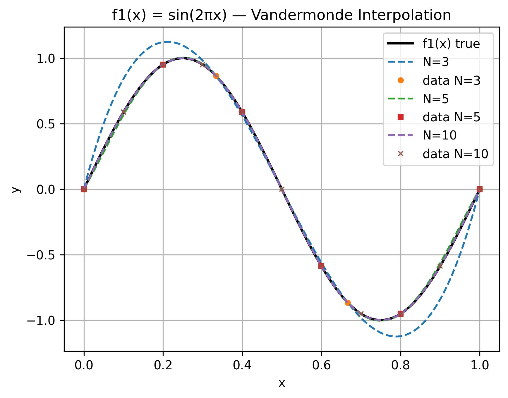
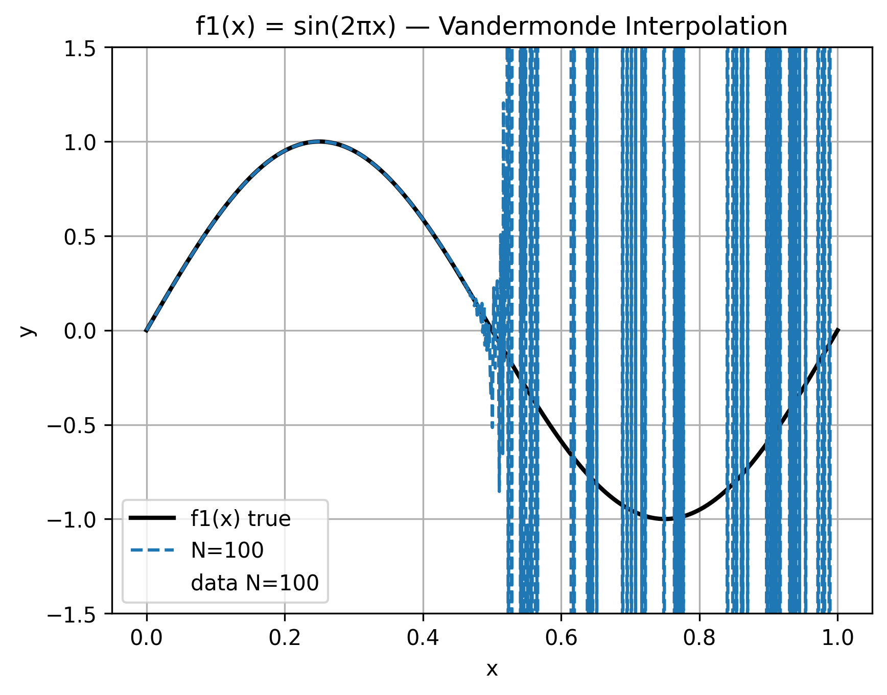
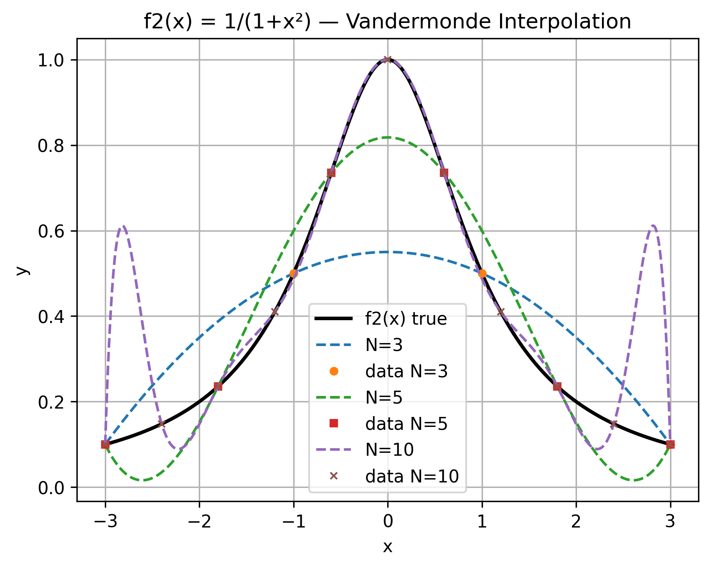
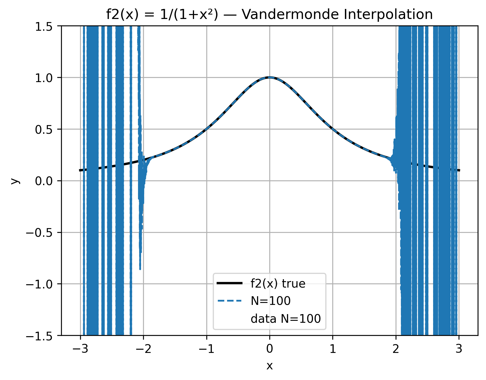

# Task 1 - Discussion: Vandermonde Interpolation

## 1. Interpolation Polynomials for N = 3

Using the Vandermonde interpolation with $N = 3$ (i.e., 4 equidistant data points), the resulting polynomials are:

**For $f_1(x) = \sin(2\pi x)$ on $[0, 1]$:**

$$p_1(x) = 23.383\,x^3 - 35.074\,x^2 + 11.691\,x$$

**For $f_2(x) = \frac{1}{1+x^2}$ on $[-3, 3]$:**

$$p_2(x) = -0.05\,x^2 + 0.55$$

It is worth noting that for $f_2$, the odd-power coefficients vanish. This is expected since $f_2$ is an even function, and the equidistant nodes on $[-3, 3]$ are also symmetric, so the interpolation naturally produces an even polynomial.

---

## 2. Approximation Quality for Increasing N

The code was run for $N = 3, 5, 10, 100$ and the interpolation polynomials were overlaid on the true functions.

### $f_1(x)$: $\sin(2\pi x)$ on $[0, 1]$

- **N = 3:** The polynomial uses only 4 data points and cannot capture the peaks and troughs of the sine curve. Significant overshoot and undershoot are visible.
- **N = 5:** The fit improves substantially and the polynomial already follows the sine curve closely.
- **N = 10:** The interpolation is nearly indistinguishable from the true function.
- **N = 100:** The interpolation completely breaks down. While the polynomial roughly follows the sine curve for $x \in [0, 0.5]$, it exhibits **extreme high-frequency oscillations** for $x \in [0.5, 1.0]$, with amplitudes reaching the y-axis limits. The coefficients are on the order of $10^{36}$, a direct consequence of the catastrophically ill-conditioned Vandermonde matrix (Condition number $\kappa \approx 10^{20}$). The enormous coefficients cause severe **catastrophic cancellation** _(large terms that should nearly cancel each other fail to do so due to floating-point rounding)_, producing visible numerical noise in the evaluated polynomial.

  
  

**Conclusion for $f_1(x)$:** Increasing $N$ improves the approximation quality up to a point. For moderate $N$ (5–10), the smooth nature of $\sin(2\pi x)$ on the short interval $[0, 1]$ allows polynomial interpolation to work effectively. However, at $N = 100$, the numerical instability of the Vandermonde matrix dominates, and the interpolation degrades drastically despite the function being smooth. This shows that even for well-behaved functions, the Vandermonde approach has a practical upper limit on $N$.

### $f_2(x)$: $\frac{1}{1+x^2}$ on $[-3, 3]$

- **N = 3:** The polynomial completely fails to capture the peak at $x = 0$.
- **N = 5:** The general bell shape is captured, but the polynomial overshoots significantly, especially towards the domain boundaries.
- **N = 10:** The fit near the center improves, but large oscillations appear near the domain boundaries.
- **N = 100:** The oscillations dominate much of the domain and the interpolation is nearly useless.

  
  

**Conclusion for $f_2(x)$:** Increasing $N$ does **not** improve the approximation. Instead, the oscillations near the boundaries grow worse. This is the **Runge phenomenon**, discussed in Section 3.

---

## 3. The Runge Phenomenon

The function $f_2(x) = \frac{1}{1+x^2}$ is the classic example introduced by Carl Runge in 1901 to demonstrate the failure of high-degree polynomial interpolation with equidistant nodes.

**What happens:** As $N$ increases, the interpolation polynomial passes exactly through all $N+1$ data points. However, *between* the data points, especially near the boundaries of the domain, the polynomial oscillates wildly. The interpolation error grows unboundedly near the edges even as it decreases near the center.

**Why does this happen?** The root cause lies in the distribution of the interpolation nodes. For equidistant nodes, the interpolation error grows exponentially with $N$. This effect is particularly noticeable near the domain boundaries where equidistant nodes are sparsely distributed.

**Why is $f_1(x)$ not affected?**
1. The interval $[0, 1]$ is short, limiting the growth of high-degree terms.
2. $\sin(2\pi x)$ is an analytic, smooth function that is well-suited for polynomial approximation.

In contrast, $f_2$ is interpolated on the wider interval $[-3, 3]$, and its sharp central peak makes it inherently difficult for a single polynomial to approximate uniformly.

**Possible remedy:** Using **Chebyshev nodes** (which cluster near the boundaries) instead of equidistant nodes eliminates the Runge phenomenon by keeping the interpolation error growing only logarithmically with $N$. Piecewise interpolation techniques (Splines) or Lagrangian interpolation could also be suitable.

---

## 4. Simulation Time for Increasing N

The measured runtimes for constructing the Vandermonde matrix and solving the linear system are:

| N   | $f_1(x)$ time (s) | $f_2(x)$ time (s) |
|-----|-------------|-------------|
| 3   | 1.59e-04    | 1.79e-05    |
| 5   | 2.72e-05    | 1.24e-05    |
| 10  | 3.84e-05    | 1.41e-05    |
| 100 | 2.35e-02    | 2.69e-02    |

For small $N$ (3, 5, 10), the runtimes are in the order of microseconds. However, the jump from $N = 10$ to $N = 100$ is significant: the runtime increases by approximately a factor of 1000.

This is consistent with the theoretical complexity:
- Constructing the Vandermonde matrix: $O(N^2)$
- Solving the linear system via `numpy.linalg.solve`: $O(N^3)$

The dominating factor is the $O(N^3)$ complexity of the linalg solver. Since $\left(\frac{100}{10}\right)^3 = 1000$, the observed ~1000× increase aligns well with the expected cubic growth.

---

## 5. Condition Number of the Vandermonde Matrices

The condition numbers of the Vandermonde matrices were computed using `numpy.linalg.cond`:

| N   | $\kappa$ for $f_1(x)$   | $\kappa$ for $f_2(x)$    |
|-----|---------------|----------------|
| 3   | 9.89e+01      | 3.10e+01       |
| 5   | 4.92e+03      | 5.23e+02       |
| 10  | 1.16e+08      | 7.09e+05       |
| 100 | **8.80e+20**  | **2.14e+62**   |

The condition number $\kappa$ measures how sensitive the solution of $V\mathbf{a} = \mathbf{y}$ is to perturbations in the input. A rule of thumb is that if $\kappa \approx 10^k$, roughly $k$ floating-point digits are lost in the solution.

**Observations:**
- The condition number grows exponentially with $N$.
- At $N = 100$, $\kappa \approx 10^{62}$ for $f_2(x)$. Since `float64` provides only ~16 digits of precision, **all digits in the solution are corrupted**. The computed coefficients are numerically meaningless.
- Even for $f_1(x)$ at $N = 100$, $\kappa \approx 10^{20}$ means roughly 20 digits are lost; far exceeding the 16 available. The individual coefficients are complete numerical noise, and any reasonable-looking result from `np.polyval` is due to catastrophic cancellation (large terms nearly cancelling each other by chance).

**Implication:** The Vandermonde matrix approach is numerically unstable for large $N$. Even when the mathematical interpolation problem is well-posed, the numerical method fails because the matrix is too ill-conditioned for floating-point arithmetic to handle.
